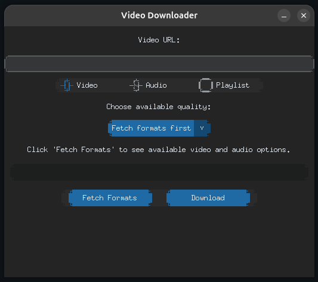

# YouTube Downloader

A modern, feature-rich YouTube downloader with a sleek GUI built with CustomTkinter. Download videos and audio from YouTube in your preferred quality with support for playlists.



## Features

- **Video & Audio Downloading**: Download videos in multiple resolutions or extract audio
- **Quality Selection**: Fetch and select from all available video resolutions and audio bitrates
- **Playlist Support**: Download entire playlists with automatic folder organization
- **Format Detection**: Automatically detects and displays available video and audio formats
- **FFmpeg Integration**: Extracts audio to MP3 format when FFmpeg is installed
- **Smart Folder Organization**: 
  - Videos → `~/Videos/`
  - Audio → `~/Music/`
  - Playlists → `~/Videos/[Playlist Name]/` or `~/Music/[Playlist Name]/`
- **Modern GUI**: Clean, responsive interface using CustomTkinter
- **Status Updates**: Real-time feedback on download progress and format fetching

## Requirements

- Python 3.8+
- `yt-dlp` - YouTube downloader library
- `customtkinter` - Modern GUI framework
- `ffmpeg` (optional) - For MP3 audio extraction

## Installation

1. **Clone the repository**
   ```bash
   git clone https://github.com/yourusername/yt-downloader.git
   cd yt-downloader
   ```

2. **Install dependencies**
   ```bash
   pip install yt-dlp customtkinter
   ```

3. **Install FFmpeg (optional but recommended)**
   
   **Ubuntu/Debian:**
   ```bash
   sudo apt-get install ffmpeg
   ```
   
   **macOS:**
   ```bash
   brew install ffmpeg
   ```
   
   **Windows:**
   Download from [ffmpeg.org](https://ffmpeg.org/download.html) or use:
   ```bash
   choco install ffmpeg
   ```

## Usage

1. **Run the application**
   ```bash
   python main.py
   ```

2. **Download a single video:**
   - Paste the YouTube URL
   - Select "Video" mode
   - Uncheck "Playlist" (default)
   - Click "Fetch Formats"
   - Select your preferred resolution
   - Click "Download"

3. **Download audio:**
   - Paste the YouTube URL
   - Select "Audio" mode
   - Uncheck "Playlist" (default)
   - Click "Fetch Formats"
   - Select your preferred bitrate
   - Click "Download"
   - If FFmpeg is installed, audio will be converted to MP3

4. **Download a playlist:**
   - Paste the playlist URL
   - Select "Video" or "Audio" mode
   - Check "Playlist"
   - Click "Fetch Formats" (skipped for playlists)
   - Click "Download"
   - Videos will be organized in a folder named after the playlist

## How It Works

1. **Format Fetching**: The app queries YouTube to get available formats without downloading
2. **Quality Selection**: Choose from all available resolutions and bitrates
3. **Smart Downloading**:
   - **Single video**: Downloads with your selected quality
   - **Playlist**: Downloads all videos at best available quality
4. **Post-Processing**: If audio mode is selected and FFmpeg is installed, converts to MP3

## File Structure

```
yt-downloader/
├── main.py              # Main application file
├── README.md            # This file
└── screenshot.png       # Application screenshot
```

## Troubleshooting

**"FFmpeg not detected" warning**
- Install FFmpeg using the instructions above
- Audio will still download but won't be converted to MP3

**"Failed to fetch formats"**
- Check your internet connection
- Verify the URL is a valid YouTube video or playlist
- Try with a different video

**"ModuleNotFoundError: customtkinter"**
- Install CustomTkinter: `pip install customtkinter`

**"ModuleNotFoundError: yt_dlp"**
- Install yt-dlp: `pip install yt-dlp`

## API Reference

### Main Functions

**`fetch_formats()`**
- Queries YouTube for available video and audio formats
- Skipped when playlist mode is enabled
- Displays available resolutions and bitrates

**`download_video()`**
- Downloads video/audio based on user selection
- Handles both single videos and playlists
- Automatically organizes files into appropriate folders

**`has_ffmpeg()`**
- Checks if FFmpeg is installed on the system
- Used to determine if MP3 conversion is available

## Configuration

The application uses these default paths:
- Videos: `~/Videos/`
- Audio: `~/Music/`

These can be modified by editing the `download_video()` function to use custom paths.

## Limitations

- Requires internet connection to fetch formats
- Cannot download age-restricted videos without authentication
- Some videos may have download restrictions
- Playlist support limited to public playlists

## Contributing

Contributions are welcome! Feel free to open issues and submit pull requests.

## License

MIT License - see LICENSE file for details

## Disclaimer

This tool is for personal use and educational purposes only. Respect copyright and terms of service of content creators. The author is not responsible for misuse of this tool.

## Support

If you encounter any issues, please:
1. Check the troubleshooting section
2. Verify all dependencies are installed
3. Open an issue on GitHub with:
   - Your OS and Python version
   - Error message
   - Steps to reproduce
